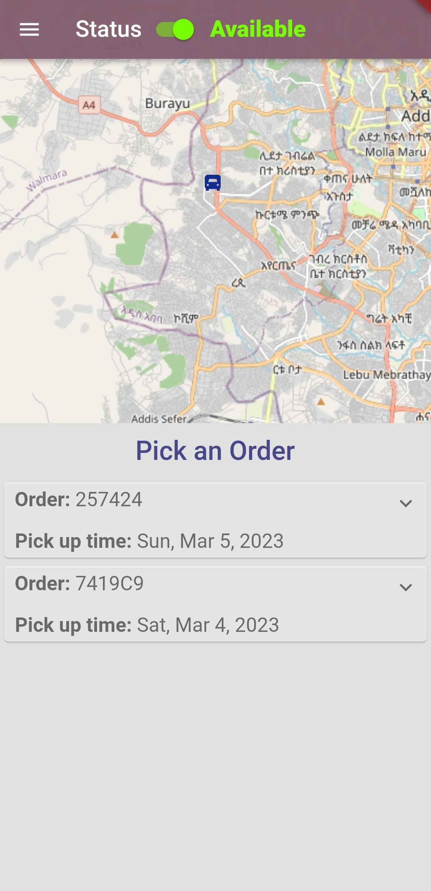
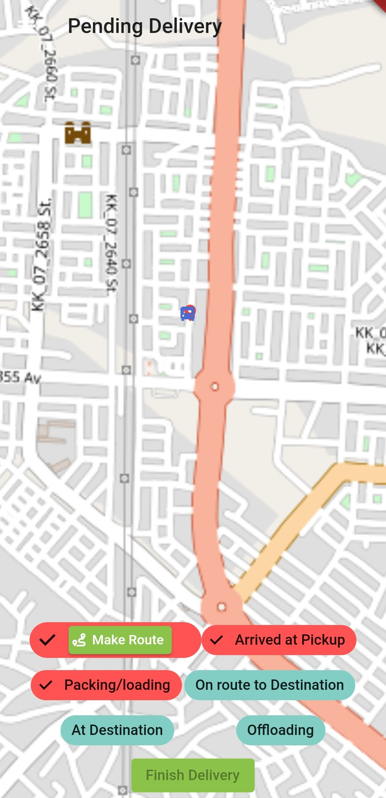
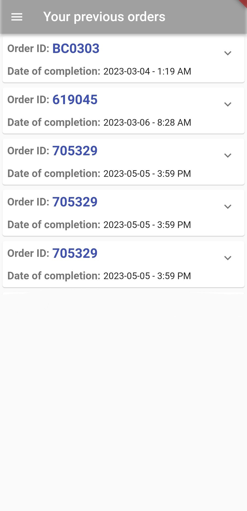

# Van Drivers

Van Drivers is a **driver management app** designed for delivery personnel within the **Van Lines/Van  it system**. The app streamlines **order fulfillment**, offering a **job board**, **optimized routing**, and **real-time status updates** to ensure efficient deliveries. Integrated with the **Van It payment system**, it allows drivers to manage transactions seamlessly while maximizing their earnings.

## Table of Contents
* [General Info](#general-information)
* [Technologies Used](#technologies-used)
* [Features](#features)
* [Screenshots](#screenshots)
* [Acknowledgements](#acknowledgements)
* [Contact](#contact)

## General Information
- Van Drivers is an **order fulfillment app** for drivers operating under the **Van Lines system**.
- The app provides a **job board** where drivers can view and accept client orders.
- **Pending orders** are displayed on a **map with optimized routing**, helping drivers navigate efficiently.
- Drivers can **track order history** and update delivery statuses in **real-time**.
- Integrated with the **Van It payment system**, drivers can **manage payments and transactions** directly within the app.
- Built using **Flutter**, **Firebase**, and **OpenStreetMap (OSM) API** for **accurate mapping and route optimization**.

## Technologies Used
- **Flutter** – Cross-platform mobile development
- **Firebase** – Backend services for authentication, data storage, and real-time updates
- **OpenStreetMap (OSM) API** – Provides navigation and route optimization for deliveries

## Features
Van Drivers enhances **delivery efficiency** with a suite of essential features:
- **Job Board** – View and accept client orders.
- **Pending Orders Map** – Navigate efficiently with optimized routes.
- **Real-Time Status Updates** – Keep customers and dispatchers informed.
- **Transaction Management** – Integrated van lines payment system for drivers.
- **Order History** – Track completed deliveries and earnings.
- **Seamless Navigation** – Powered by **OpenStreetMap API**.

## Screenshots

| Jobs Page             | Pending Orders Page     | Previous Orders Page   |
| ---------------------- | ---------------------- | ---------------------- |
|  |  |  |

## Acknowledgements
- This project integrates **OpenStreetMap API** for accurate navigation and routing. It available at (https://github.com/liodali/osm_flutter), which played a pivotal role in its implementation. A heartfelt appreciation goes to Mohamed Ali Hamza for his exceptional contribution in developing this invaluable package. Be sure to explore his work at (https://github.com/liodali).

## Contact
Created by [@OBRND](https://github.com/OBRND) - feel free to contact me!  

